# Documentación de la Infraestructura de Red y Virtualización en Proxmox VE

Este documento detalla los pasos seguidos en el nodo Proxmox (`pve`) para establecer la red interna, el enrutamiento (NAT) y la creación de las máquinas virtuales (VMs) de DNS/DHCP y Web.

## 1\. Configuración de Red del Nodo Proxmox (Host)

La configuración de red se gestiona a través del archivo `/etc/network/interfaces` en el servidor Proxmox. Se utilizan dos puentes (`vmbr0` y `redwp`) para separar el tráfico WAN y LAN.

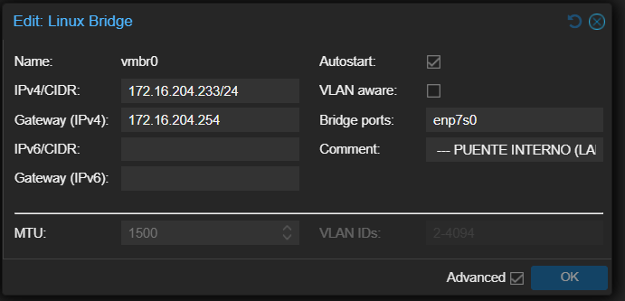
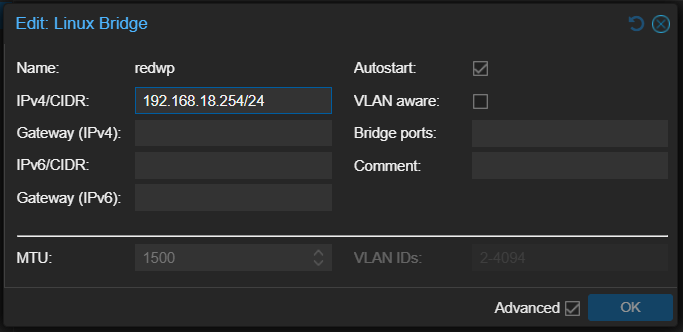

### 1.1 Creación de la Red Interna (Linux Bridge)

Se crea el puente **`redwp`** (Linux Bridge) que actuará como la red interna (LAN) para todas las máquinas virtuales. Este puente no tiene un puerto físico y está configurado para la subred privada **`192.168.18.0/24`** y su IP estática **`192.168.18.254/24`**.

### 1.2 Configuración del Archivo `/etc/network/interfaces`

Esta configuración consolida el puente WAN (`vmbr0`) con el puente LAN (`redwp`) e incluye las reglas de NAT para asegurar que la red interna pueda salir a Internet.

La configuración es la siguiente:

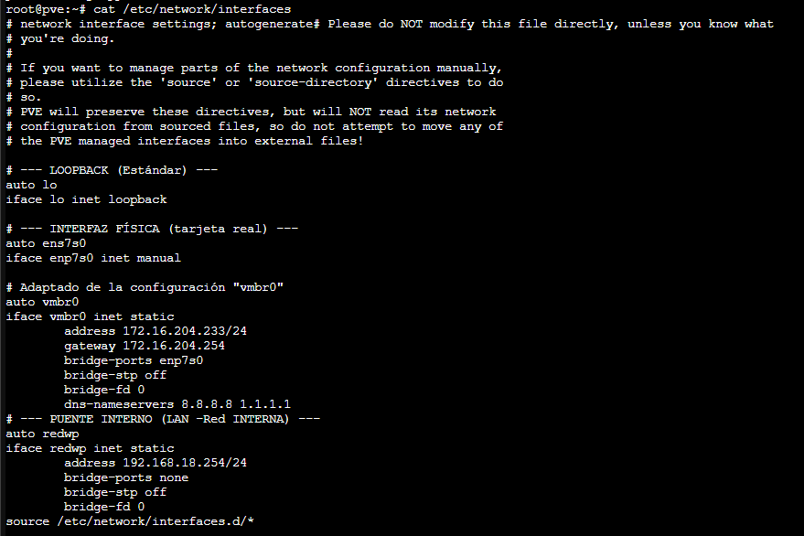
Una vez modificado el archivo, se aplican los cambios:

```bash
systemctl restart networking
```

## 2\. Configuración de NAT en el Nodo Proxmox.

Se configuran las reglas de NAT (Enmascaramiento) y Forzamiento de Tráfico (Forwarding) de manera persistente usando el paquete `iptables-persistent`.

### 2.1 Activar IP forwarding


1. Creamos el fichero en `/etc/sysctl.d/` :
```bash
sudo nano /etc/sysctl.d/99-ipforward.conf
```
2. Escribimos en su interior el siguiente código:
```bash
net.ipv4.ip_forward=1
```
3. Aplicamos los cambios del sistema guardando.
```bash
sysctl --system
```
4. Comprobamos que quedó activo:
```bash
sysctl net.ipv4.ip_forward
# Debe devolver: net.ipv4.ip_forward = 1
```
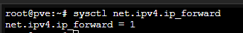


### 2.2 Preparación e Instalación de `iptables-persistent`

1.  **Añadir Repositorios de Debian:**
    Editar `/etc/apt/sources.list` y agregar las líneas de repositorios de Debian:

    ```bash
    sudo nano /etc/apt/sources.list
    deb http://deb.debian.org/debian bookworm main contrib
    deb http://deb.debian.org/debian bookworm-updates main contrib
    ```

2.  **Actualizar e Instalar:**

    ```bash
    sudo apt update
    sudo apt install -y iptables-persistent
    ```
### 2.3 Reglas NAT y Forwarding

Aplicamos las iptable correspondientes para dar accedo a Internet a la red de nuestra **`redwp`**:

1.  **Regla de Enmascaramiento (NAT):** Permite que el tráfico de la red interna (`192.168.18.0/24`) salga por la interfaz WAN (`vmbr0`) usando la IP pública del Proxmox.
    ```bash
    sudo iptables -t nat -A POSTROUTING -s 192.168.18.0/24 -o vmbr0 -j MASQUERADE
    ```
2.  **Reglas de Forwarding (Apertura de tráfico):** Permite el tráfico de salida y de retorno.
    ```bash
    sudo iptables -A FORWARD -s 192.168.18.0/24 -o vmbr0 -j ACCEPT
    sudo iptables -A FORWARD -d 192.168.18.0/24 -m state --state ESTABLISHED,RELATED -i vmbr0 -j ACCEPT
    ```
### 2.4 Hacer las Reglas Persistentes

Finalmente, se guardan las reglas activas para que se carguen automáticamente en cada reinicio:

```bash
sudo netfilter-persistent save
```

## 3\. Creación y Configuración de Máquinas Virtuales (VMs)

Se crearon al menos dos máquinas virtuales (DNS/DHCP y WordPress) siguiendo estos pasos.

1.  **Creación de la VM:**
      * **General:** Asignar un ID y nombre.
      * **OS:** Cargar la imagen ISO de Ubuntu Server.
      * **System, Disks:** Configuración estándar de hardware.
      * **CPU/RAM:** Asignar recursos suficientes.

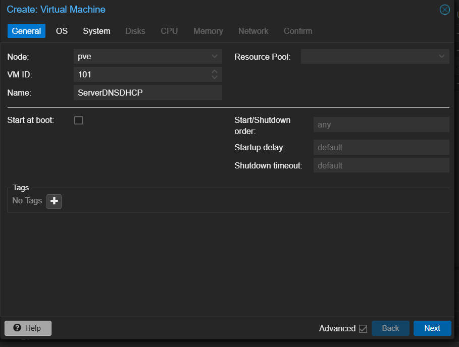
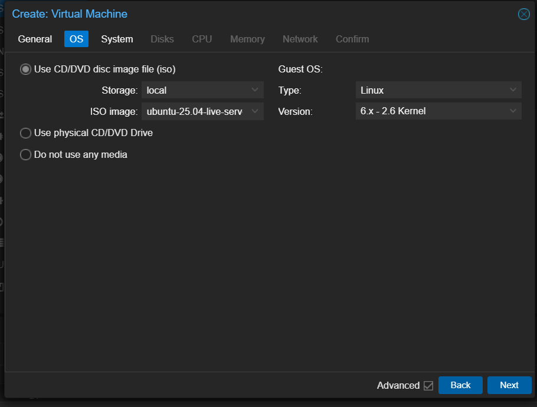
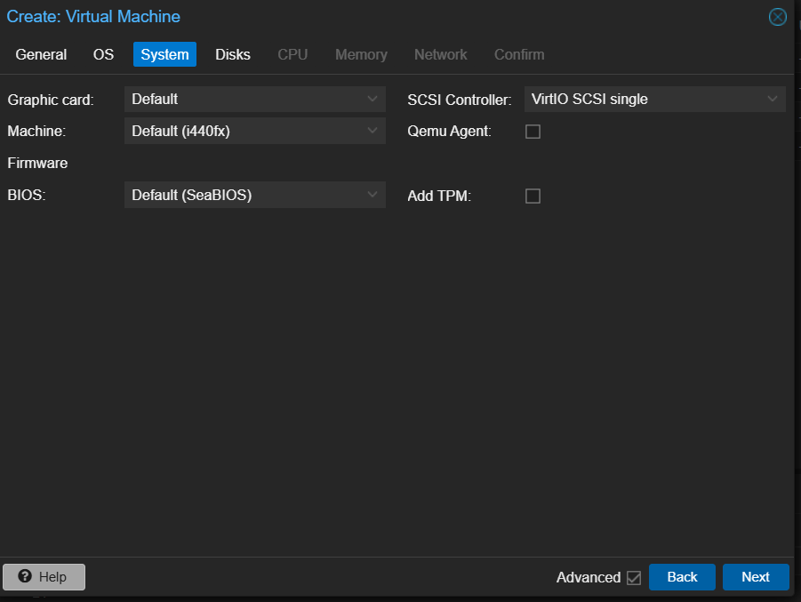
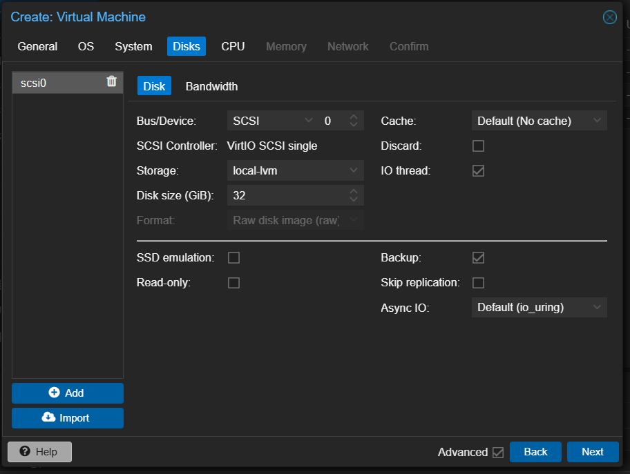

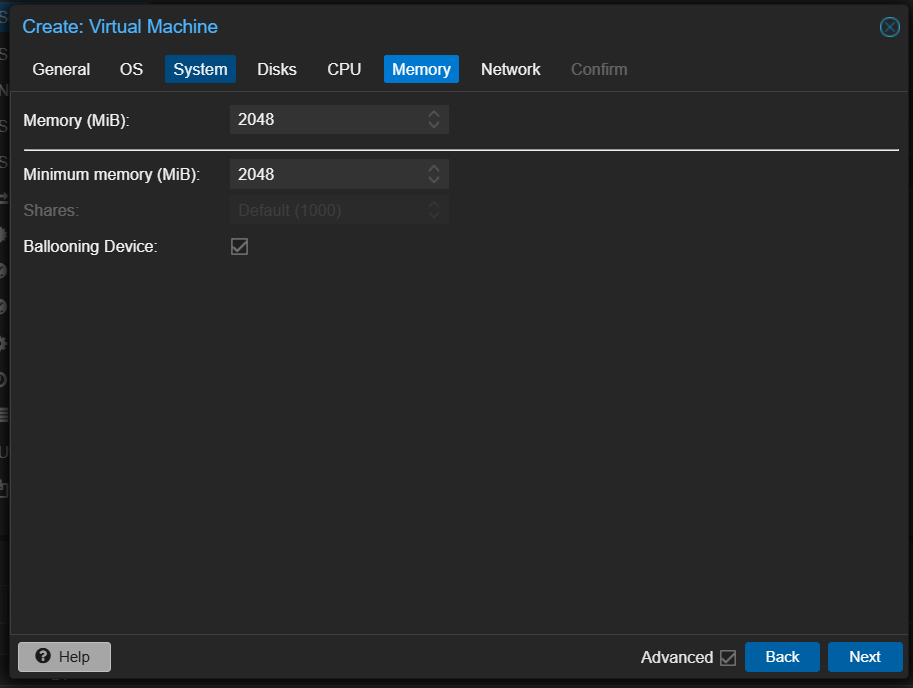
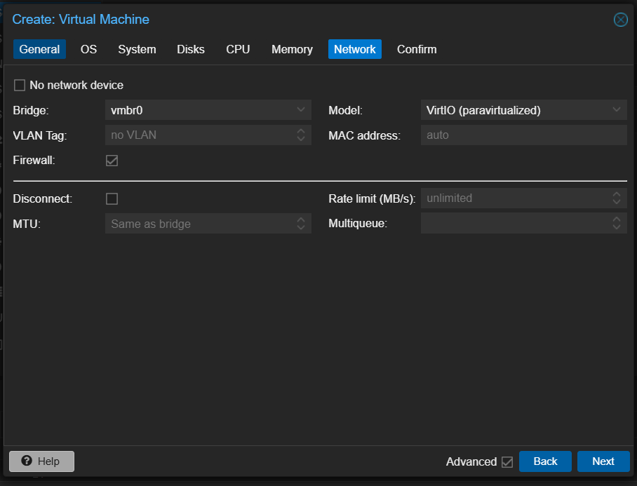
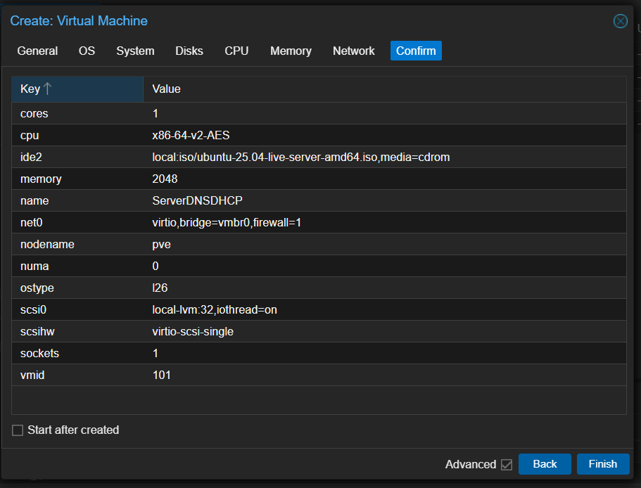

2.  **Conexión a la Red Interna:**

    En la pestaña **Hardware** de la VM, en la configuración de la **Tarjeta de Red**, se selecciona el puente **`redwp`** para que las VMs estén en la red privada `192.168.18.x`.

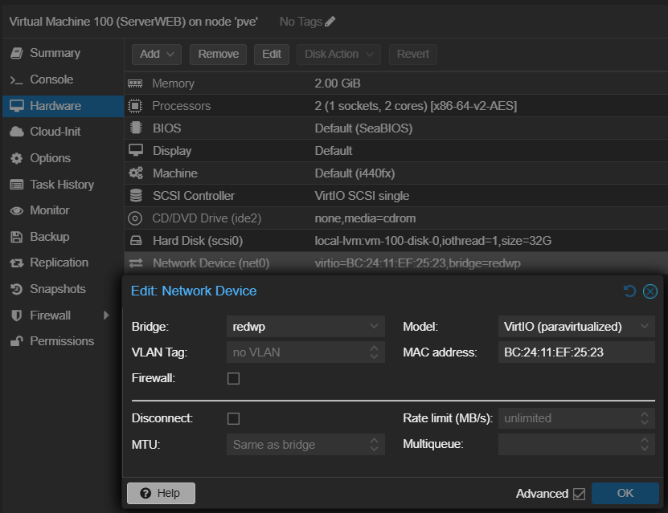
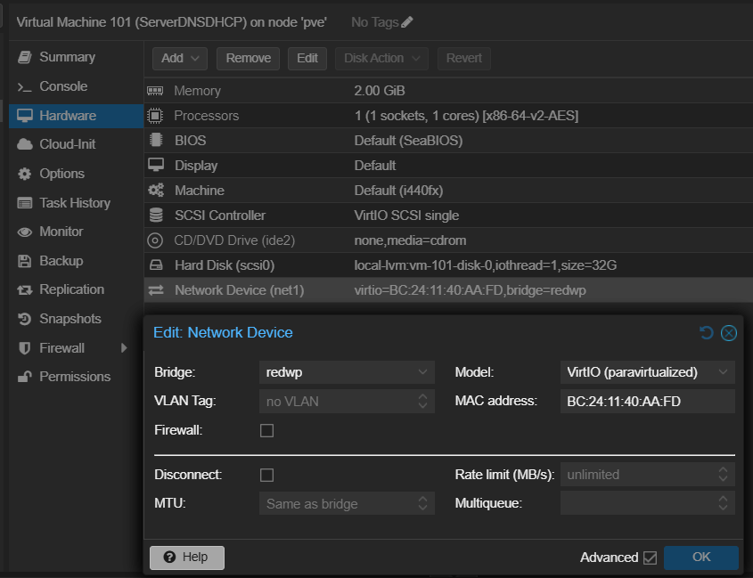

3. **Instalación de los servers**
    
    Cuando instalemos los Servidores, es seguir los pasos del Instalador, elegir el nombre, contraseña, etc... al gusto y importante activar la opción de SSH.

4.  **Configuración de IPs:**
    En nuestro Server DNS/DHCP pondremos una IP estática y el Server WEB recibira una IP del DHCP de nuestro Server DHCP:
    **Netplan** (el archivo `.yaml` dentro de `/etc/netplan/`):

| Máquina | IP Asignada | Gateway | DNS |
| :--- | :--- | :--- | :--- |
| **DNS/DHCP Server** | `192.168.18.1/24` | `192.168.18.254` | `1.1.1.1.1`, `8.8.8.8` |
| **WordPress Server** | `DHCP` | `DHCP` | `DHCP` |

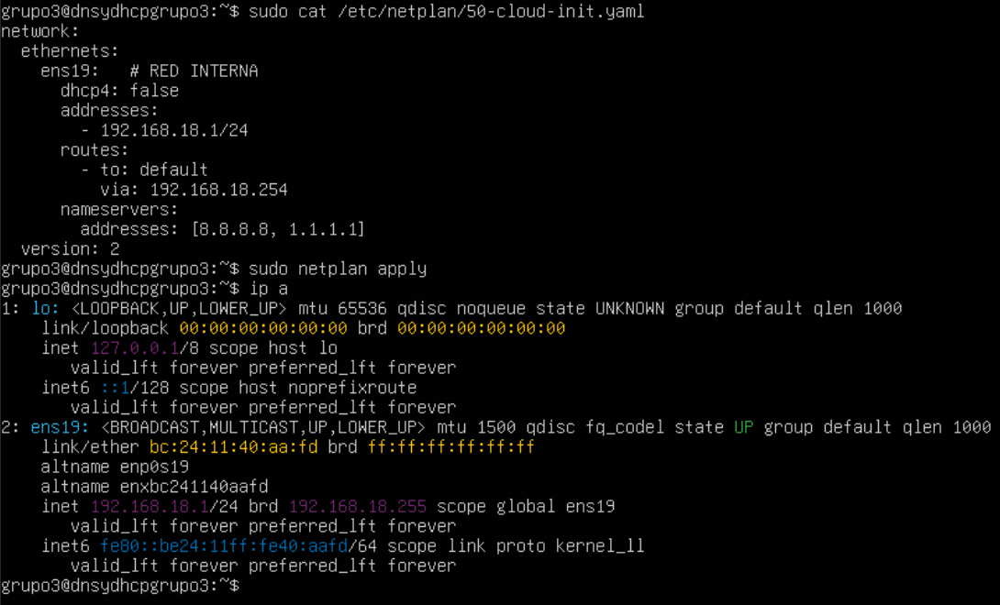
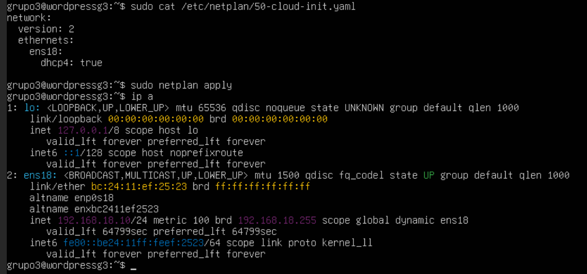

Si hemos hecho la configuración de la red Interna y el NAT, ambos Servers deberían tener conexión entre sí y al Servidor Proxmox.
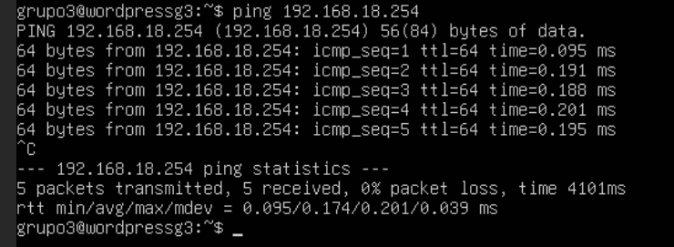
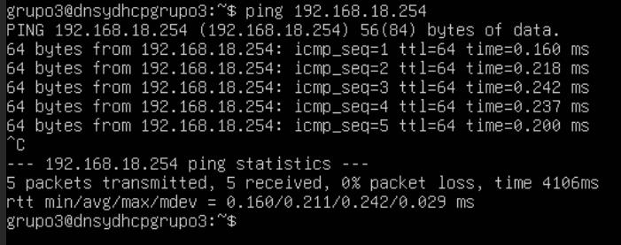
Y acceso a Internet.
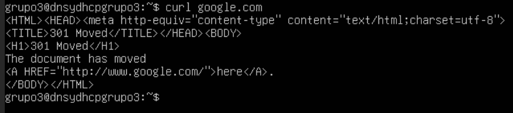
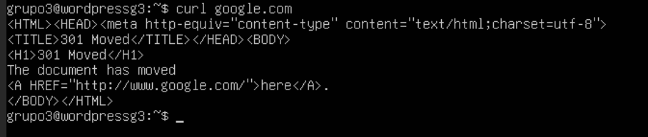