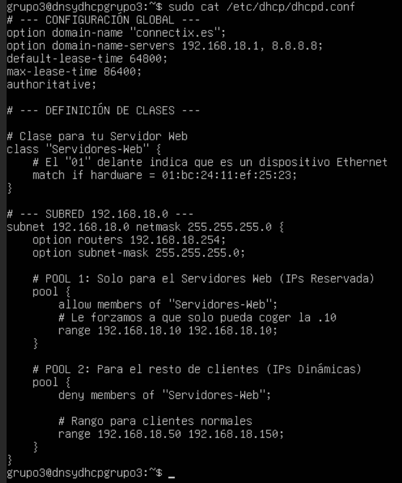
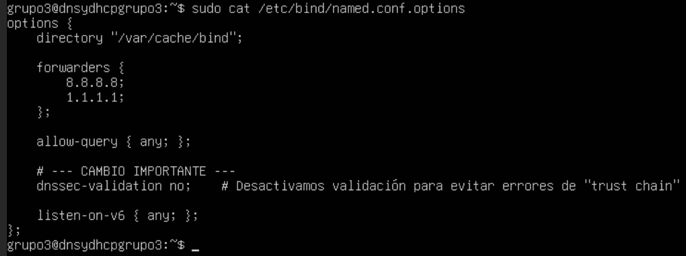
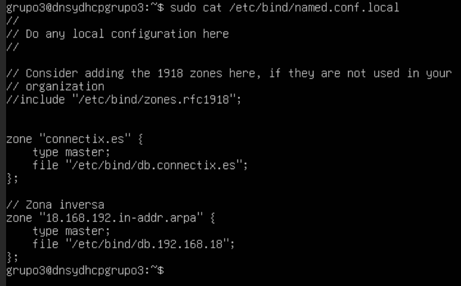
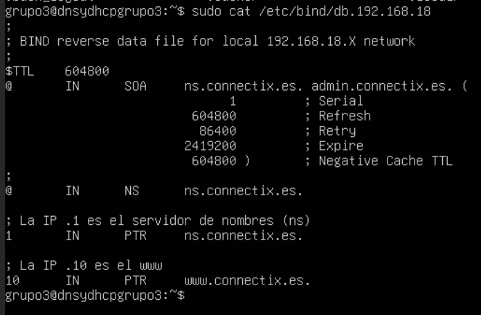
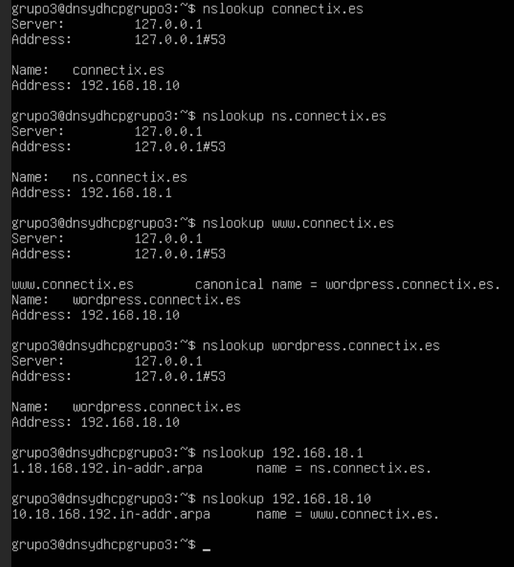
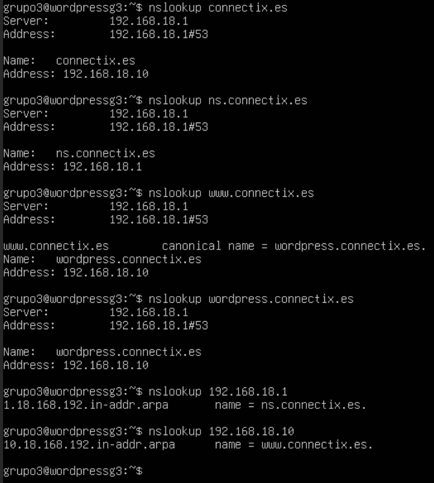

# 4\. Configuración del Servidor de Infraestructura (DNS y DHCP)

El servidor `dnsydhcpgrupo3` actúa como el controlador principal de la red interna, proporcionando direccionamiento IP dinámico y resolución de nombres.


## 4.2. Configuración del Servicio DHCP

Se utiliza `isc-dhcp-server`. La configuración define el dominio `connectix.es`, los servidores DNS que se entregarán a los clientes y dos pools de direcciones: uno reservado para servidores web y otro para clientes generales.

**Archivo:** `/etc/dhcp/dhcpd.conf`

```conf
option domain-name "connectix.es";
option domain-name-servers 192.168.18.1, 8.8.8.8;
default-lease-time 64800;
max-lease-time 86400;
authoritative;

class "Servidores-Web" {
    match if hardware = 01:bc:24:11:ef:25:23;
}

subnet 192.168.18.0 netmask 255.255.255.0 {
    option routers 192.168.18.254;
    option subnet-mask 255.255.255.0;
    pool {
        allow members of "Servidores-Web";
        range 192.168.18.10 192.168.18.10;
    }
    pool {
        deny members of "Servidores-Web";
        range 192.168.18.50 192.168.18.150;
    }
}
```

-----

## 4.3. Configuración del Servicio DNS

Se configura Bind9 para resolver el dominio local.

### 4.3.1 Opciones Globales y Reenvío

Se configuran los "forwarders" (reenviadores) para que el servidor sepa preguntar a Google si no conoce un dominio. Además, se desactiva `dnssec-validation` para evitar errores de validación en entornos de laboratorio.

**Archivo:** `/etc/bind/named.conf.options`

```bind
options {
    directory "/var/cache/bind";
    forwarders {
        8.8.8.8;
        1.1.1.1;
    };
    allow-query { any; };
    dnssec-validation no;
    listen-on-v6 { any; };
};
```


### 4.3.2 Declaración de Zonas Locales

Se definen las zonas maestra directa (`connectix.es`) e inversa (`18.168.192.in-addr.arpa`).

**Archivo:** `/etc/bind/named.conf.local`

```bind
zone "connectix.es" {
    type master;
    file "/etc/bind/db.connectix.es";
};
// Zona inversa
zone "18.168.192.in-addr.arpa" {
    type master;
    file "/etc/bind/db.192.168.18";
};
```



### 4.3.3 Archivo de Zona Directa

Define la traducción de nombres a IPs. Se incluye un registro `CNAME` para que `www` apunte a `wordpress`.

**Archivo:** `/etc/bind/db.connectix.es`

```bind
; BIND data file for connectix.es
$TTL    604800
@       IN      SOA     ns.connectix.es. admin.connectix.es. (
                              2         ; Serial
                         604800         ; Refresh
                          86400         ; Retry
                        2419200         ; Expire
                         604800 )       ; Negative Cache TTL
;
@       IN      NS      ns.connectix.es.

ns          IN      A       192.168.18.1  
wordpress   IN      A       192.168.18.10 
www         IN      CNAME   wordpress
@           IN      A       192.168.18.10
```


### 4.3.4 Archivo de Zona Inversa

Define la traducción de IPs a nombres (PTR).

**Archivo:** `/etc/bind/db.192.168.18`

```bind
; BIND reverse data file for local 192.168.18.X network
$TTL    604800
@       IN      SOA     ns.connectix.es. admin.connectix.es. (
                              1         ; Serial ...
                         ... )
;
@       IN      NS      ns.connectix.es.
1       IN      PTR     ns.connectix.es.
10      IN      PTR     www.connectix.es.
```

-----

## 4.4. Configuración del Resolver Local (`resolv.conf`)

Para garantizar que los 2 servidores utilicen su propio servicio Bind9 y resuelva correctamente las zonas locales, se configuró manualmente el archivo `/etc/resolv.conf`.

**Archivo:** `/etc/resolv.conf`

```text
nameserver 127.0.0.1 (o 192.168.18.1 en el caso de Server WEB)
options edns0 trust-ad
search connectix.es       # Dominio de búsqueda
```

**Verificación:**
Usamos el comando nslookup para comprobar que todas las zonas funcionan, en ambos servers.

