# 5\. Configuración del Servidor Web (WordPress)

El servidor `wordpressg3` aloja la aplicación web. Se opta por utilizar la pila **XAMPP** y un túnel SSH para la configuración visual remota.
Antes de nada se añadió, un adaptador vmbr0 que va a la red externa de Proxmox para poder obtener conexión SSH, se le asigno una IP del rango de esa red, la ip 172.16.204.138.
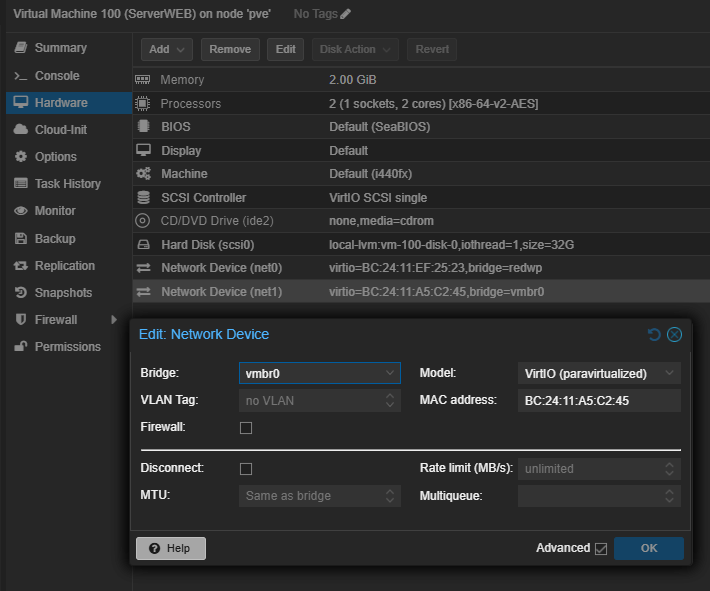

## 5.1. Instalación de XAMPP (Pila LAMP)

En lugar de instalar los paquetes de Apache por separado, se utiliza el instalador integrado XAMPP para Linux (versión 8.2.12), que agrupa Apache, MySQL y PHP.

**1. Descarga del instalador:**
Desde la terminal del servidor, se descarga el paquete `.run` oficial:

```bash
wget https://sourceforge.net/projects/xampp/files/XAMPP%20Linux/8.2.12/xampp-linux-x64-8.2.12-0-installer.run
```

**2. Asignación de permisos de ejecución:**
Se otorgan permisos para poder ejecutar el archivo descargado:

```bash
chmod 755 xampp-linux-x64-8.2.12-0-installer.run
```
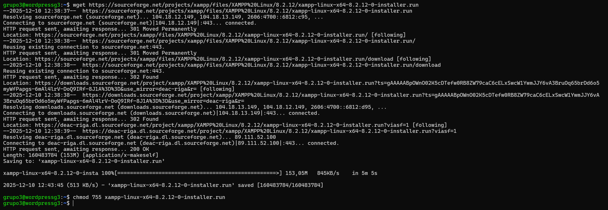


**3. Instalación en Modo Texto:**
Al no disponer de entorno gráfico, es obligatorio usar el flag `--mode text`. Se siguen las instrucciones en pantalla (aceptando las opciones por defecto con `Y` y `Enter`).

```bash
sudo ./xampp-linux-x64-8.2.12-0-installer.run --mode text
```
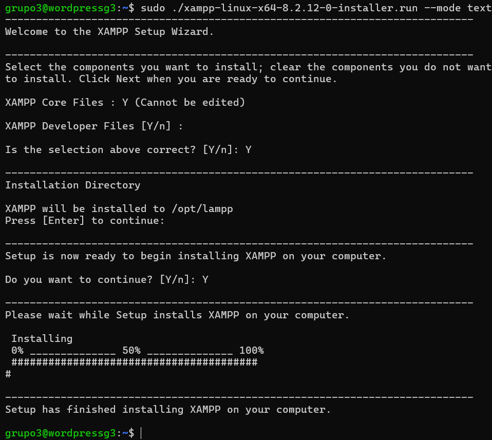

**4. Inicio del servicio:**
Una vez instalado, se inicia XAMPP manualmente:

```bash
sudo /opt/lampp/lampp start
```
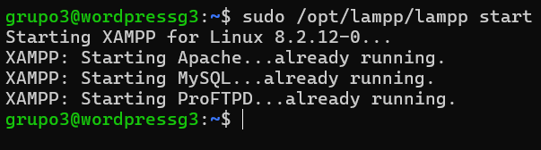

## 5.2. Despliegue de Archivos de WordPress

Se realizan las tareas previas de descarga y asignación de permisos necesarias para que WordPress funcione dentro de la estructura de directorios de XAMPP.

**1. Descarga y descompresión:**
Se navega al directorio público de XAMPP (`htdocs`) y se descarga la última versión de WordPress:

```bash
cd /opt/lampp/htdocs
sudo wget https://wordpress.org/latest.zip
sudo unzip ./latest.zip
```
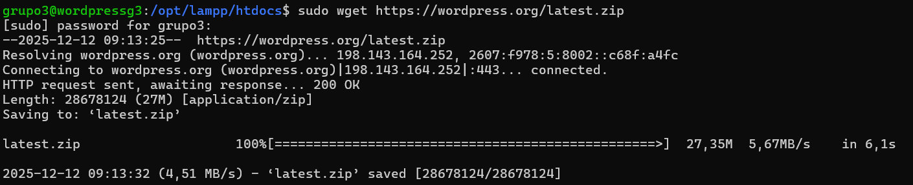
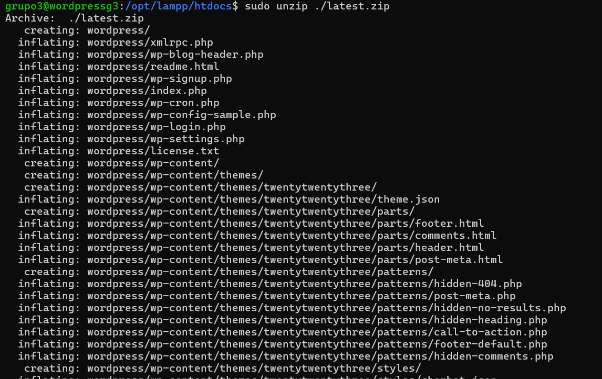

Esto genera la carpeta `/opt/lampp/htdocs/wordpress`.
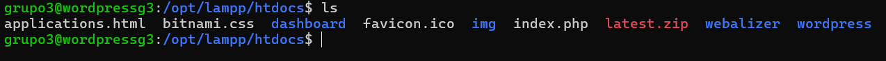

**2. Ajuste de Permisos (Crítico):**
Para permitir que WordPress pueda crear su archivo de configuración (`wp-config.php`) y subir archivos multimedia, se cambia el propietario de la carpeta al usuario `daemon` (el usuario que utiliza XAMPP por defecto):

```bash
sudo chown -R daemon:daemon /opt/lampp/htdocs/wordpress
sudo chmod -R 755 /opt/lampp/htdocs/wordpress
```
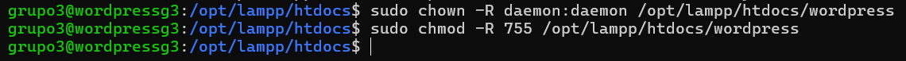

## 5.3. Acceso Remoto Seguro (Túnel SSH) y Base de Datos

Dado que el servidor está en una red privada y no tiene navegador, se estableció un **túnel SSH** desde el equipo anfitrión para acceder a las herramientas de configuración web (`phpMyAdmin` e instalador de WordPress) de forma segura.

**1. Creación del Túnel SSH:**
Desde el ordenador cliente (Windows/Linux), se ejecutó el siguiente comando para redirigir el tráfico local del puerto `8443` hacia el puerto `443` (HTTPS) del servidor remoto:

```bash
# Comando ejecutado desde el host cliente
ssh -L 8443:localhost:443 grupo3@172.16.204.138
```
imagen

Pudimos saber los puertos gracias al comando:
```bash
ss -ntlp
```
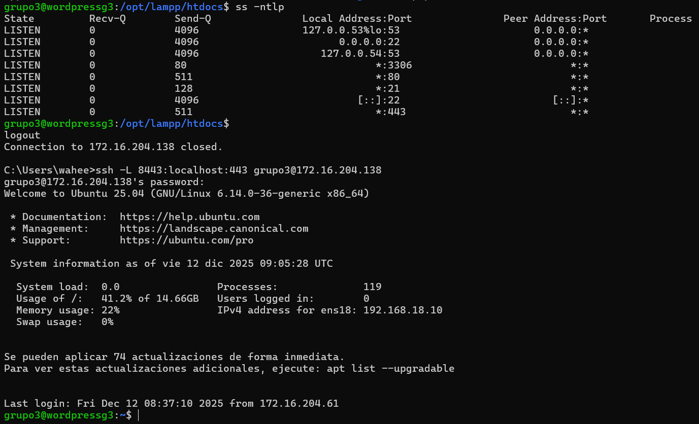

*Nota: Esto permite acceder al servidor escribiendo `https://localhost:8443` en el navegador del cliente.*

**2. Creación de Base de Datos y Usuario:**
Accediendo a `https://localhost:8443/phpmyadmin`, se creó el usuario y la base de datos simultáneamente:

  * **Sección:** Cuentas de usuarios \> Agregar cuenta de usuario.
  * **Usuario:** `grupo3`
  * **Host:** `Local` (localhost)
  * **Opción marcada:** "Crear base de datos con el mismo nombre y otorgar todos los privilegios".
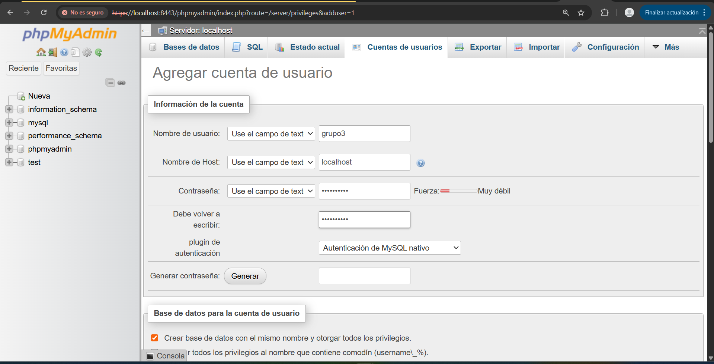

## 5.4. Instalación Final de WordPress

Con la base de datos lista y el túnel activo, se finaliza la instalación vía navegador accediendo a:
`https://localhost:8443/wordpress`

**1. Configuración de conexión a Base de Datos:**
Se introducen los credenciales creados en el paso anterior:

  * **Nombre de la base de datos:** `grupo3`
  * **Nombre de usuario:** `grupo3`
  * **Contraseña:** `[Contraseña definida en phpMyAdmin]`
  * **Servidor de la base de datos:** `localhost`
  * **Prefijo de tabla:** `wp_`
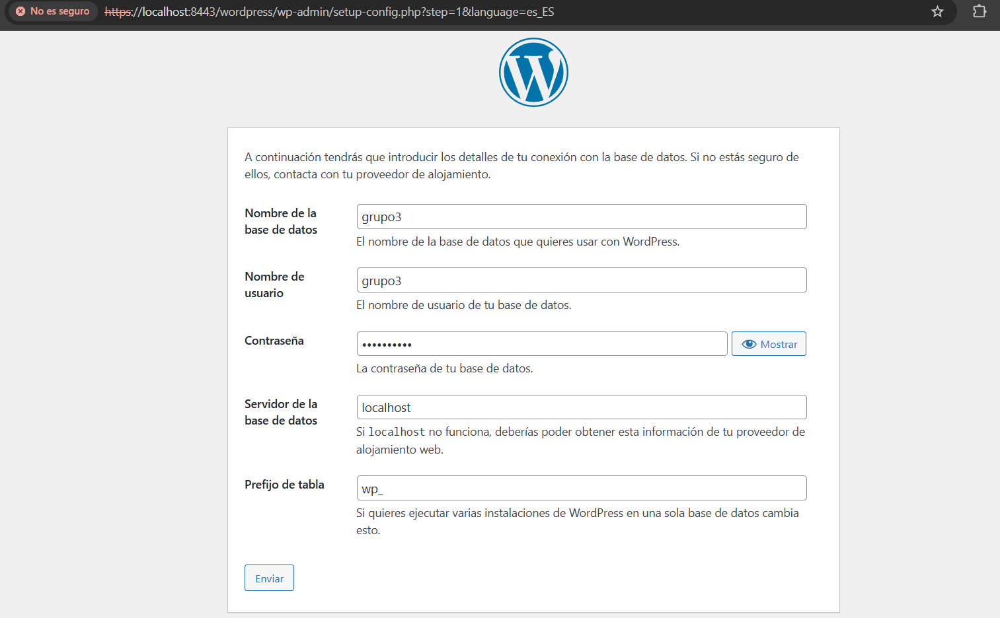

**2. Configuración del Sitio:**
Se definen los parámetros generales del sitio web:

  * **Título del sitio:** CONNECTIX
  * **Nombre de usuario (Administrador):** admin
  * **Correo electrónico:** [Correo del alumno]
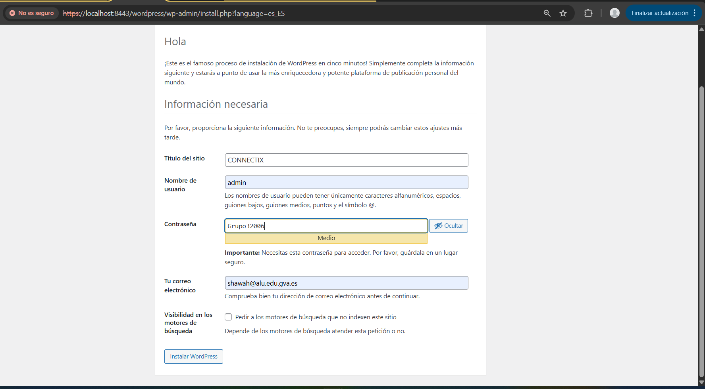

Tras completar este proceso, el CMS WordPress queda. totalmente operativo y accesible desde la red interna.
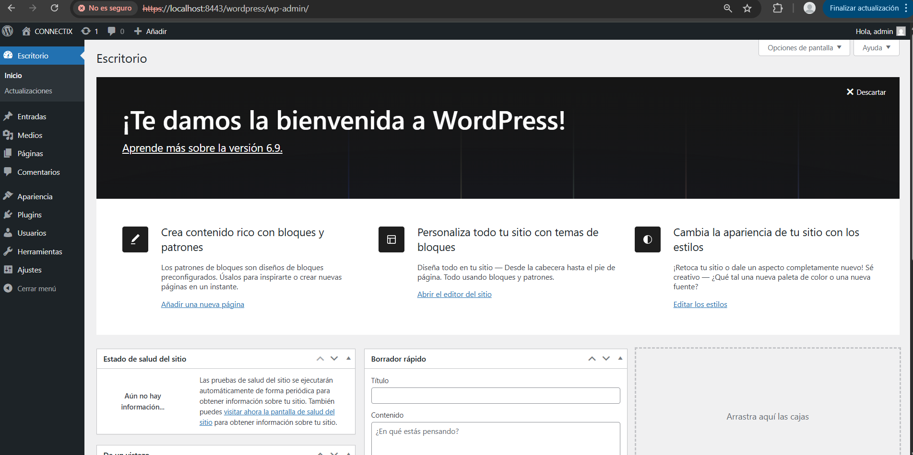

## 5.5. Configuración de Dominio Propio y Acceso Seguro (SSL)

Una vez instalado WordPress, se realizó una configuración avanzada para permitir el acceso mediante el dominio `https://www.connectix.es` (eliminando la necesidad de escribir `/wordpress` en la URL) y solucionar problemas de rutas con plugins.

### 1. Resolución de Nombres (Cliente y Servidor)

Como el dominio no es público, se simuló la resolución DNS en el cliente (Windows) y se configuró el enrutamiento en el servidor (Proxmox).

**A. Archivo Hosts (Windows):**
Se modificó el archivo `C:\Windows\System32\drivers\etc\hosts` para apuntar el dominio a la IP del servidor Proxmox.
*Explicación:* Esto "engaña" al navegador para que sepa que `www.connectix.es` corresponde a nuestro servidor.

```powershell
172.16.204.138 www.connectix.es connectix.es
```


**B. Redirección de Puertos (NAT en Proxmox):**
En el nodo Proxmox, se configuraron reglas de `iptables` para redirigir el tráfico Web (80) y SSL (443) hacia la máquina virtual (`192.168.18.10`).
*Explicación:* Permite que las peticiones externas lleguen a la VM interna de forma transparente.

```bash
# Redirección de puertos 80 y 443 a la IP de la VM
iptables -t nat -A PREROUTING -i vmbr0 -p tcp --dport 80 -j DNAT --to 192.168.18.10:80
iptables -t nat -A PREROUTING -i vmbr0 -p tcp --dport 443 -j DNAT --to 192.168.18.10:443
```
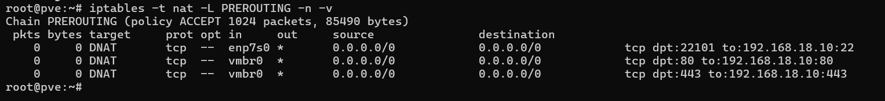

### 2. Configuración del Servidor Web (Apache)

Se modificó la configuración de Apache para servir la web desde la raíz del dominio.

**Archivos modificados:** `/opt/lampp/etc/httpd.conf` y `/opt/lampp/etc/extra/httpd-ssl.conf`.
*Explicación:* Al cambiar el `DocumentRoot` a `/opt/lampp/htdocs/wordpress`, Apache sirve el contenido directamente al entrar al dominio, sin necesidad de rutas adicionales.

```apache
DocumentRoot "/opt/lampp/htdocs/wordpress"
<Directory "/opt/lampp/htdocs/wordpress">
```


### 3. Ajustes del Núcleo de WordPress

Se editó el archivo `wp-config.php` para definir la nueva identidad del sitio y permitir la gestión de archivos.

**Código añadido:**
*Explicación:* `WP_HOME` fuerza el uso de HTTPS y el dominio correcto. `FS_METHOD` permite instalar plugins sin necesidad de configurar un servidor FTP, escribiendo directamente en disco.

```php
define( 'WP_HOME', 'https://www.connectix.es' );
define( 'WP_SITEURL', 'https://www.connectix.es' );
```
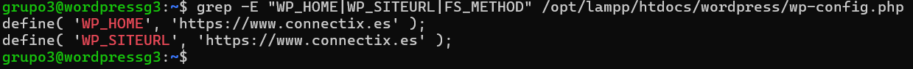

### 4. Solución de Estructura de Archivos (Enlace Simbólico)

Para solucionar errores con plugins de migración (como *All-in-One WP Migration*) que no encontraban la ruta correcta debido al cambio de `DocumentRoot`, se implementó un enlace simbólico.

**Comando ejecutado:**
*Explicación:* Se crea un "espejo" en `htdocs/wp-content` que redirige automáticamente a `wordpress/wp-content`. Esto satisface tanto a Apache (que mira dentro de wordpress) como a los plugins.

```bash
# Crear enlace simbólico para unificar rutas
sudo ln -s /opt/lampp/htdocs/wordpress/wp-content /opt/lampp/htdocs/wp-content
# Asignar permisos totales (Entorno de desarrollo) para evitar bloqueos
sudo chmod -R 777 /opt/lampp/htdocs/wordpress/wp-content
```
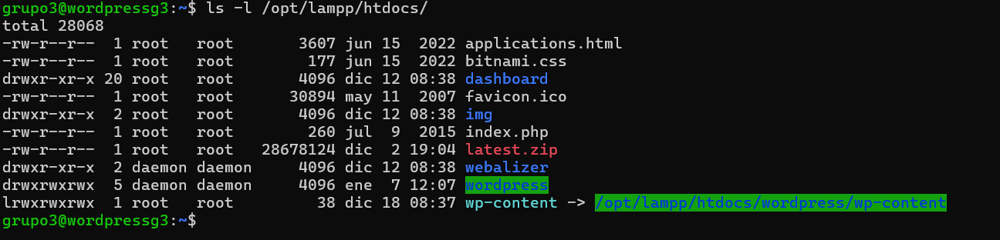

### 5. Verificación
Y como podemos comprobar en la imagen, hemos accedido a nuestro Wordpress con el enlace que hemos configurado.
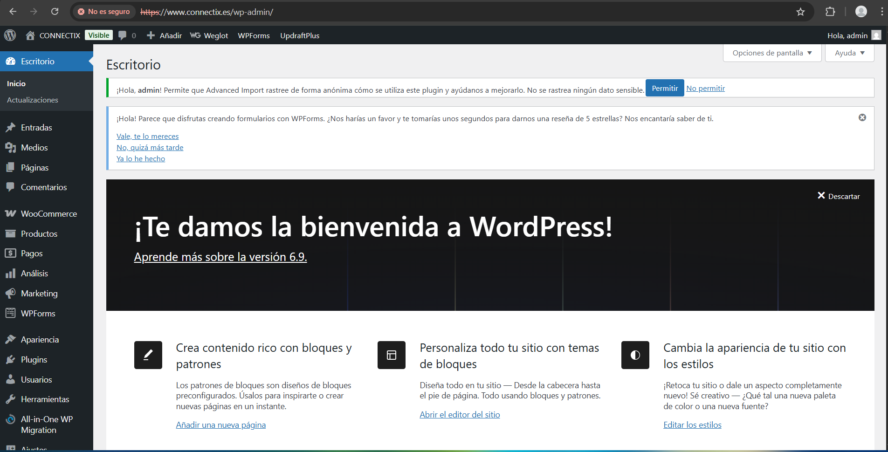